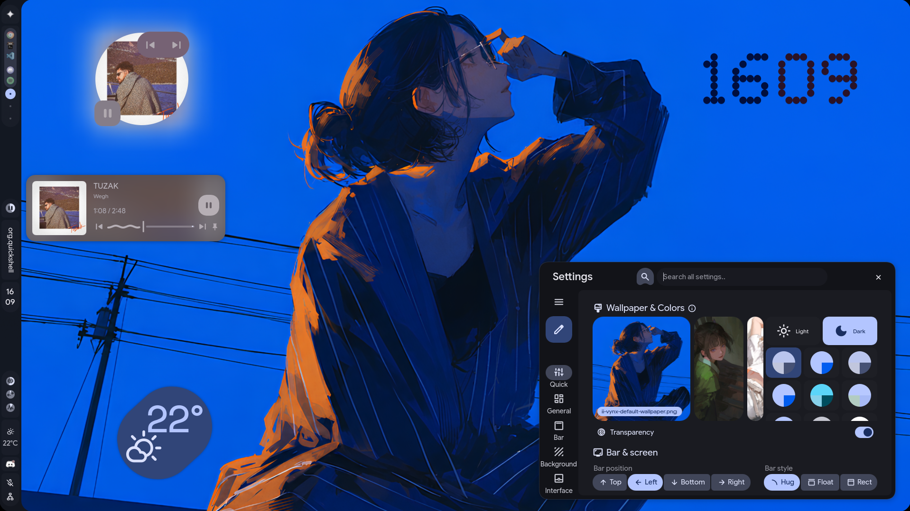
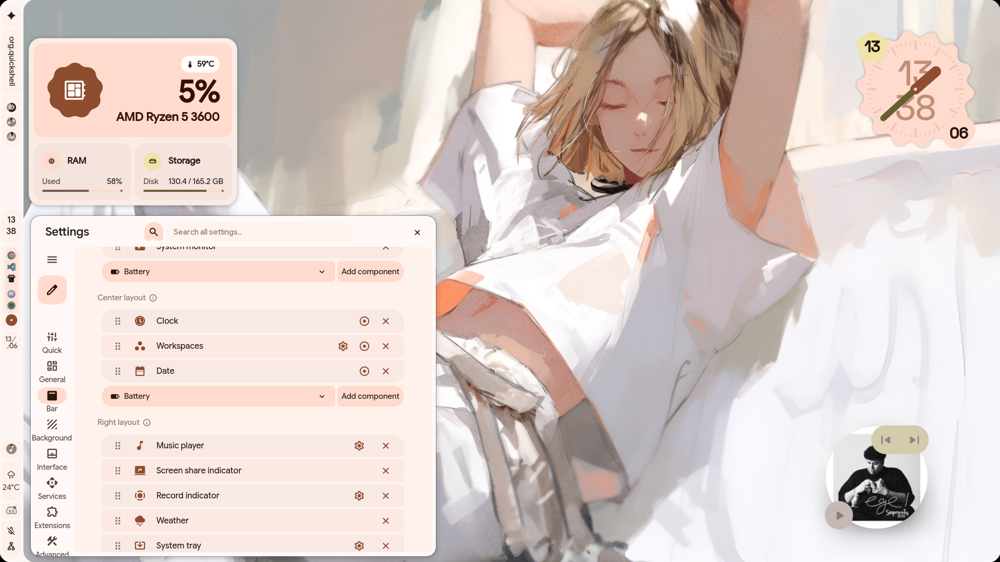
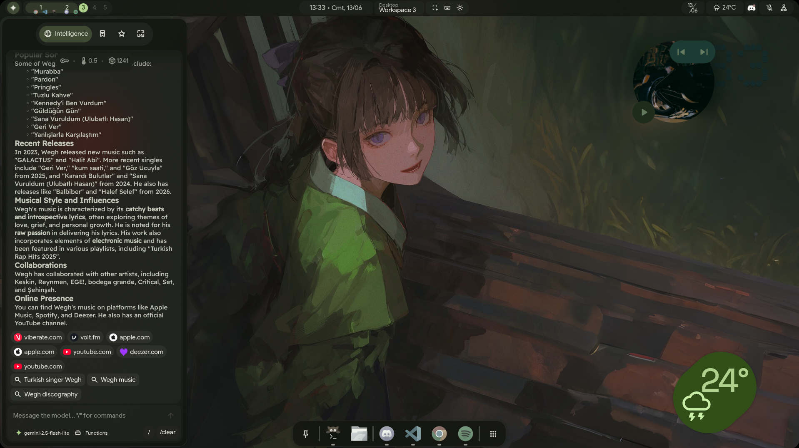
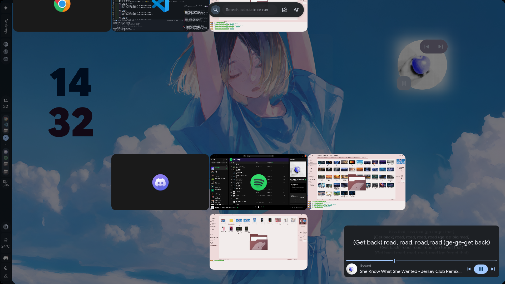
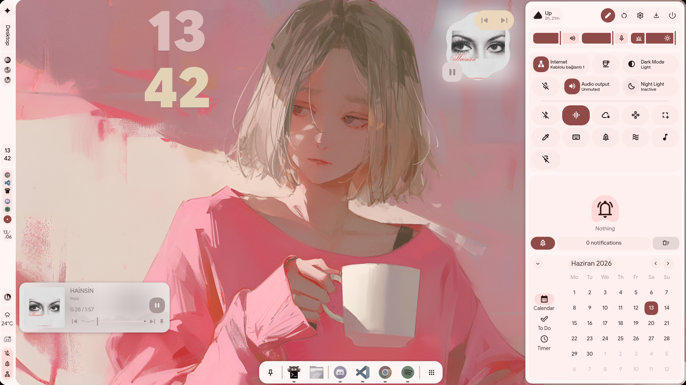

<div align="center">
    <h1>【 Hypr Impulse 】</h1>
    <p>Personal Hyprland dotfiles based on <b>ii-vynx</b> and <b>illogical-impulse</b></p>
</div>

<div align="center"> 



<div style="display:flex; gap:10px; justify-content:center;">
  
  
</div>
<div style="display:flex; gap:10px; justify-content:center;">
  
  
</div>

</div>

---

<div align="center">
    <h2> overview & disclaimer </h2>
</div>

This repository is my daily driver desktop environment for Arch Linux + Hyprland, built on top of the **ii-vynx** architecture and **illogical-impulse**.

It includes personal customizations, experimental features, dynamic Material You theming, extension support, and integrations with modern GPU wallpaper backends like `skwd`.

> **Note:** This is an active personal workstation setup. I experiment and iterate directly here—expect occasional bleeding-edge breakage. Use at your own discretion.

---

<div align="center">
    <h2> installation </h2>
</div>

Clone the repository recursively to ensure all submodules (such as custom shape widgets) are pulled:

```bash
git clone https://github.com/Ahorts/hypr-impulse.git --recurse-submodules && cd hypr-impulse && ./setup-ii-vynx.sh
```

View available setup options and flags:
```bash
./setup-ii-vynx.sh --help
```

---

<div align="center">
    <h2> updating </h2>
</div>

You can update your setup using any of the following methods:

- **CLI:** Run `vynx update` or `./setup-ii-vynx.sh`
- **Dashboard UI:** Trigger the update action directly from the settings panel

<div align="center">
    
</div>

---

<div align="center">
    <h2> extensions </h2>
</div>

Custom shell extensions can be developed or loaded via **Settings > Extensions**.

Check [.github/EXTENSIONS.md](.github/EXTENSIONS.md) for the extension development guide and architecture specifications.

---

<div align="center">
    <h2> credits </h2>
</div>

- **[end-4](https://github.com/end-4)** — The creator of [illogical-impulse](https://github.com/end-4/dots-hyprland), pioneering Material 3 design on Linux desktops.
- **[vaguesyntax](https://github.com/vaguesyntax)** — For [ii-vynx](https://github.com/vaguesyntax/ii-vynx), the extension architecture, and modular shell optimizations.
- **[liixini](https://github.com/liixini)** — For [skwd](https://github.com/liixini/skwd) & [skwd-wall](https://github.com/liixini/skwd-wall) wallpaper engine suite.
- **[Quickshell](https://quickshell.org/)** — The flexible, reactive QtQuick/QML widget system powering the entire shell UI.
- **[Hyprland](https://hypr.land/)** — Fluid dynamic tiling Wayland compositor.

<div align="center">
    <p>Star the repo if you like it! ⭐</p>
</div>


